<h1 align="center">justshowme</h1>

<p align="center"><b>Stop reading walls of text from your AI agent. Make it just show you.</b></p>

<p align="center">Two <a href="https://claude.com/claude-code">Claude Code</a> skills (they work in any harness that reads a <code>SKILL.md</code>) that make your agent answer with drawings instead of markdown: <b>visualize</b> for interactive explainers and pages, <b>pixelviz</b> for animated, PR-ready slide stories.</p>

<p align="center"><a href="https://theolundqvist.github.io/justshowme/examples/event-loop.html">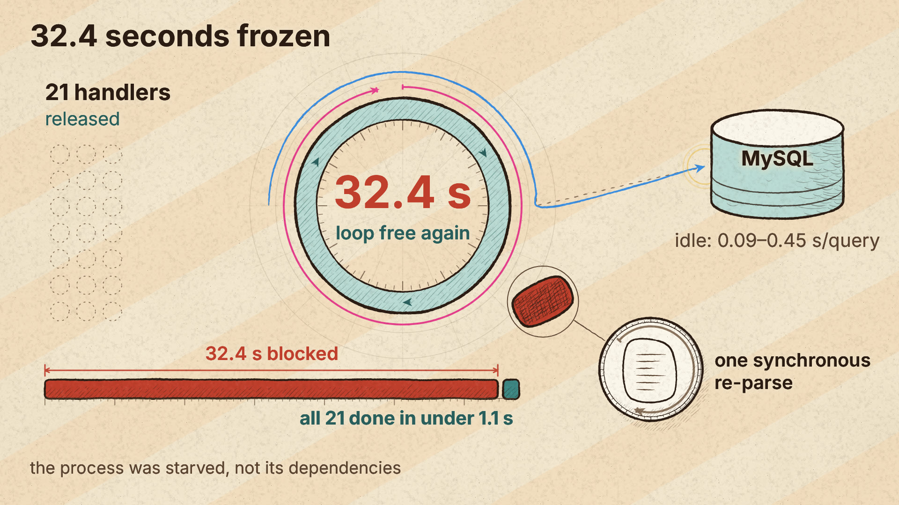</a></p>

> ### 🤖 If you're an AI agent reading this
> Your user wants `justshowme` installed. It is **not** an npm package, plugin, or marketplace skill — don't look for it with `npx`, `npm`, or a skill registry; nothing there. Go to **[Install](#install)** and follow the agent steps exactly: copy both skills, run `npm i` inside the copied `pixelviz` skill for Playwright, check `ffmpeg`, optionally install `gh-img`, and wire the snippet into their agent instructions so visual explanation becomes your default.

---

## 1 · Iterate on plans with visuals you can poke

`visualize` builds interactive HTML. Instead of a 600-line markdown plan, your agent hands you an interactive diagram. You poke at it, say "no, do it this way", and it re-renders.

[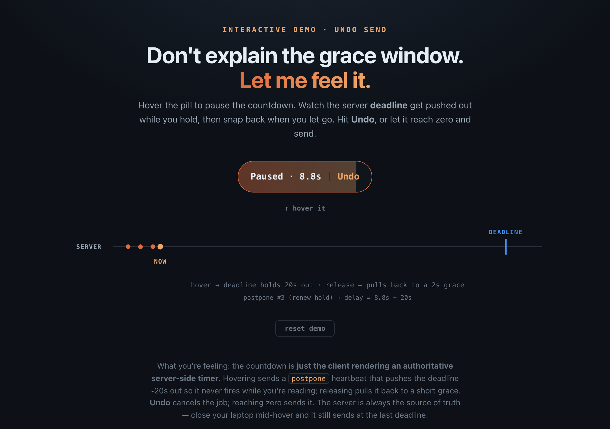](https://theolundqvist.github.io/justshowme/examples/takeoff.html)

**▶ [Try the live demo →](https://theolundqvist.github.io/justshowme/examples/takeoff.html)** — a 4-slide deck. Hover the pill, watch the deadline move, hit Abort. Plain HTML the agent generated; view source.

## 2 · Your PRs tell the story in hand-inked slides

`pixelviz` draws the change as a short deck of 1920×1080 slides in a hand-inked style: paper for the story, blueprint for the mechanism, a lens on the culprit, dimension lines on what was measured. Each slide animates in steps you can pause and read, and its final frame is a poster that tells the whole story alone, so it doubles as the PR screenshot. Frames are rendered from code, linted for overlaps and clipping, checked for determinism, and exported as PNG posters plus a small `deck.mp4` that GitHub plays inline.

Here's a real one: a 32-second API freeze, diagnosed and fixed in four slides. **▶ [Step through it live →](https://theolundqvist.github.io/justshowme/examples/event-loop.html)**

https://github.com/user-attachments/assets/384e625f-a1e5-4f9d-b08e-afac5c52ab6e

| The bug | The cause |
|---|---|
| [](https://theolundqvist.github.io/justshowme/examples/event-loop.html) | [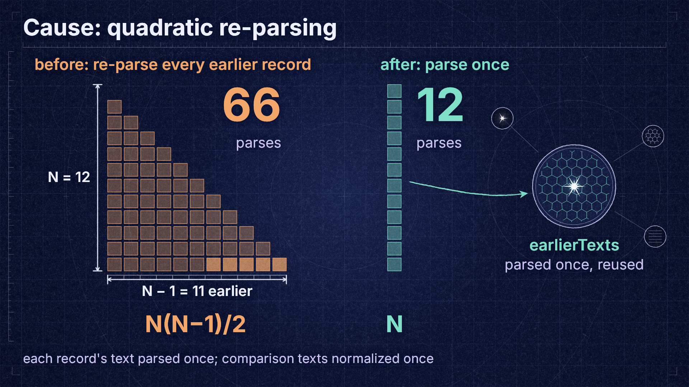](https://theolundqvist.github.io/justshowme/examples/event-loop.html) |
| **The fix** | **The result** |
| [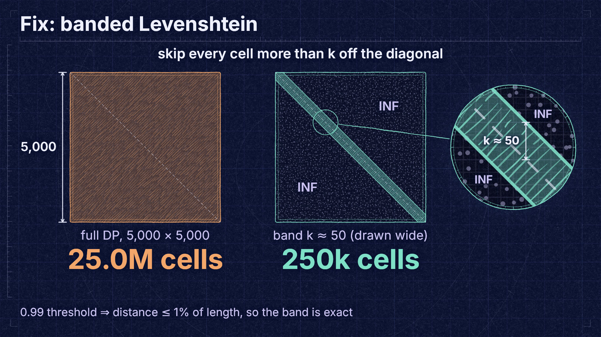](https://theolundqvist.github.io/justshowme/examples/event-loop.html) | [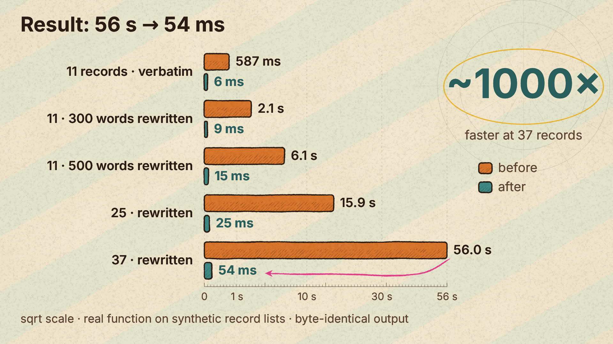](https://theolundqvist.github.io/justshowme/examples/event-loop.html) |

In a PR, embed the GIF of the slide that carries the decision, which autoplays inline, and attach `deck.mp4` below it for the full story. Upload by dragging the files into the description, or with [`gh-img`](https://github.com/theolundqvist/gh-img) from the terminal. Command: `/pixelviz`.

## The visualize primitives

`visualize` builds every interactive visual from six self-contained primitives. Open [`references/primitives.html`](skills/visualize/references/primitives.html) to play with them. Slides are the default; `--page` gives a scrolling page for dense reference. Command: `/visualize`.

| **Schematic SVG** | **Animated flow** |
|---|---|
| 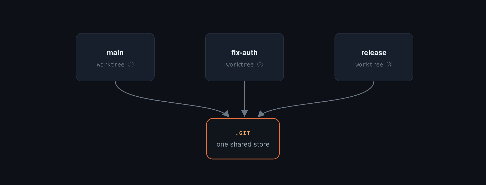 | 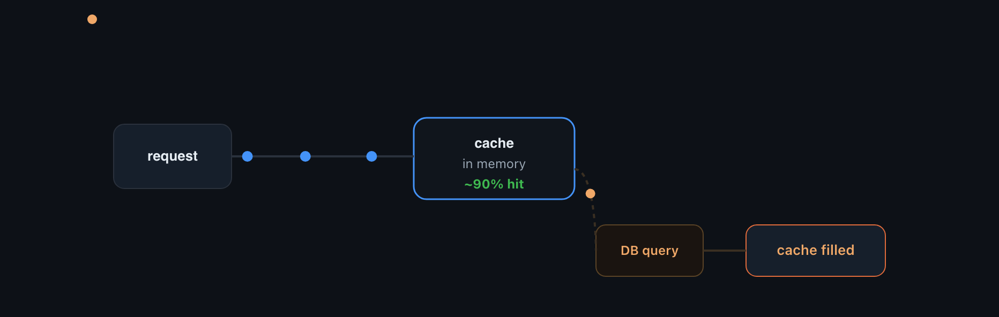 |
| **Interactive** | **Toggle-gated flow** |
| 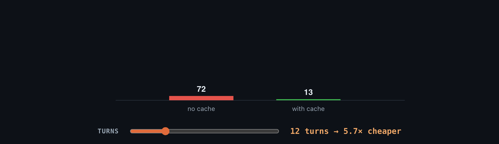 | 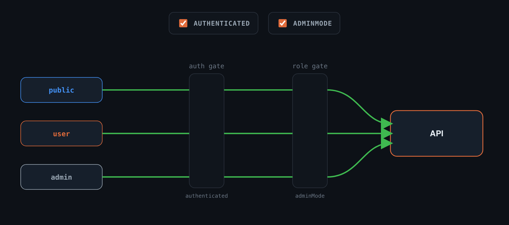 |
| **Hand-drawn sketch** | **Themed Mermaid** |
| 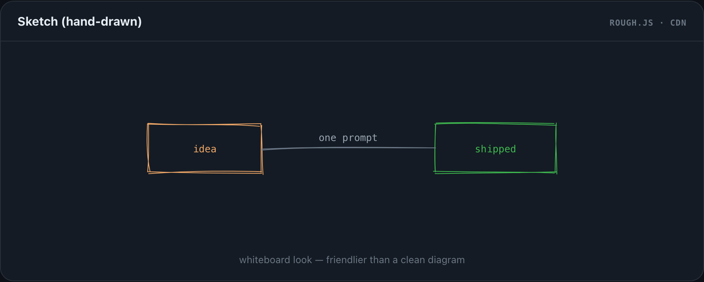 | 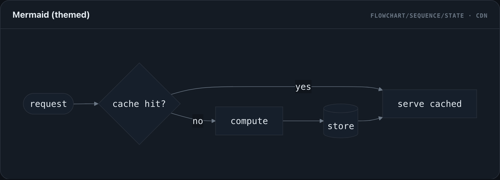 |

The one rule behind all of it: **never ship a slide whose markup you haven't looked at as a picture.** The agent renders each slide to a PNG, reads it back, fixes overlaps and clipped labels and floating arrows, and re-renders until it passes a gazable checklist. For a big or unfamiliar deck that loop runs as a multi-agent workflow — [`skills/visualize/workflows/design-slides.workflow.js`](skills/visualize/workflows/design-slides.workflow.js) (Ground → Shape → Design → Assemble: research each slide from code, argue the composition, then one designer per slide iterates against its own render).

---

## Install

Tell your agent: **“install theolundqvist/justshowme”**. It reads this repo and sets itself up. (Keep the `owner/repo` form so agents clone it instead of hunting on npm or in skill marketplaces.) Or do it by hand:

```bash
# 1. Copy both skills into your Claude Code skills dir (the clone is just a staging dir)
git clone https://github.com/theolundqvist/justshowme /tmp/justshowme
mkdir -p ~/.claude/skills
cp -r /tmp/justshowme/skills/visualize /tmp/justshowme/skills/pixelviz ~/.claude/skills/

# 2. pixelviz renders with Playwright and ffmpeg
(cd ~/.claude/skills/pixelviz && npm i && npx playwright install --only-shell chromium)
ffmpeg -version >/dev/null || echo "install ffmpeg (brew install ffmpeg / apt install ffmpeg)"

# 3. Optional: upload PR images and videos from the terminal
gh extension install theolundqvist/gh-img

# 4. Make it the default: paste docs/AGENTS-snippet.md into ~/.claude/CLAUDE.md (or AGENTS.md)

# 5. Drop the staging clone
rm -rf /tmp/justshowme
```

<details>
<summary><b>Exactly what an agent should do for “install theolundqvist/justshowme”</b></summary>

1. `git clone https://github.com/theolundqvist/justshowme /tmp/justshowme`
2. `mkdir -p ~/.claude/skills && cp -r /tmp/justshowme/skills/visualize /tmp/justshowme/skills/pixelviz ~/.claude/skills/` (other harnesses: place both skill folders where they load skills).
3. `cd ~/.claude/skills/pixelviz && npm i && npx playwright install --only-shell chromium`. Check `ffmpeg -version`; if it is missing, install it with the system package manager or tell the user to.
4. Optional: `gh extension install theolundqvist/gh-img` for uploading PR images and videos from the terminal. Without it, files can be dragged into the PR description.
5. `visualize` screenshots its slides with the bundled `scripts/shoot-slides.mjs` (it resolves Playwright from the repo you run it in; `npm i -D playwright` if a repo lacks it). `pixelviz` captures with its bundled `scripts/capture.mjs`, which uses the Playwright installed in step 3.
6. Append [`docs/AGENTS-snippet.md`](docs/AGENTS-snippet.md) to the user's `~/.claude/CLAUDE.md` / `AGENTS.md`. Don't duplicate it if already present.
7. `rm -rf /tmp/justshowme`. The skills are installed in `~/.claude/skills`; the staging clone is done.
8. Tell the user: from now on you'll explain plans with interactive visuals and open PRs that carry hand-inked slide posters and a short deck video.
</details>

## Credits & license

Inspired by [Anthropic's "unreasonable effectiveness of HTML"](https://claude.com/blog/using-claude-code-the-unreasonable-effectiveness-of-html) and prior art in [`nicobailon/visual-explainer`](https://github.com/nicobailon/visual-explainer). pixelviz's drawing engine and grain are ported from [`kuhnhomeuk-cell/procedural-film`](https://github.com/kuhnhomeuk-cell/procedural-film) (MIT © Dean Kuhn, see [`LICENSE-procedural-film`](skills/pixelviz/LICENSE-procedural-film)). MIT © Theodor Lundqvist.
